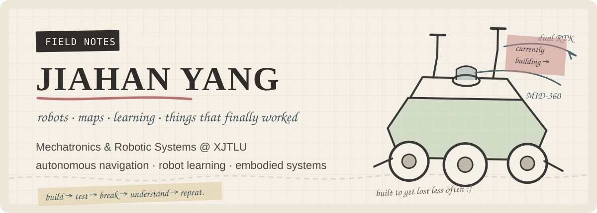
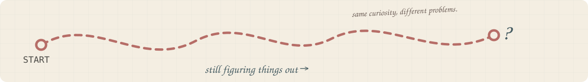

<div align="center">
  
</div>

<p align="center">
  <a href="https://yangbadger222.github.io"><b>field site ↗</b></a>
  &nbsp;·&nbsp;
  <a href="https://yangbadger222.github.io/assets/jiahan.yang.pdf"><b>cv ↗</b></a>
  &nbsp;·&nbsp;
  <a href="mailto:Yangbadger222@gmail.com"><b>email ↗</b></a>
  &nbsp;·&nbsp;
  <a href="https://badgerlog.icu"><b>notes / blog ↗</b></a>
</p>

---

### `01 / ABOUT`

I'm **Jiahan Yang**, a Mechatronics & Robotic Systems student at **Xi'an Jiaotong-Liverpool University**.

I like building systems that have to leave the screen eventually — robots that need to **know where they are, decide where to go, and actually do something in the physical world**.

My work currently sits around **autonomous navigation, GNSS / RTK, SLAM, robot learning, loco-manipulation, and embodied intelligence**.

> *current question in the margin →*  
> **How can a robot combine imperfect global information with local perception and still navigate reliably?**

---

### `02 / SELECTED FIELD NOTES`

<table>
<tr>
<td width="50%" valign="top">

<code>FIELD NOTE / 01</code>

#### Finding the way.

**[XJTLU Autonomous Vehicle — RTK ↗](https://github.com/Yangbadger222/XJTLU-autonomous-vehicle-rtk)**  
RTK route navigation and real-robot autonomy around a ROS 2 mobile platform.

`ROS 2` · `FAST-LIO2` · `Nav2` · `GNSS / RTK` · `Jetson`

<sub>also working close to the hardware → [STM32 side ↗](https://github.com/Yangbadger222/XJTLU-autonomous-vehicle-stm32)</sub>

</td>
<td width="50%" valign="top">

<code>FIELD NOTE / 02</code>

#### Robots learning from humans.

**[ReKep × SO-101 ↗](https://github.com/Yangbadger222/rekep_so101)**  
Real-robot manipulation experiments around keypoint constraints, imitation learning and physical execution.

`SO-101` · `robot manipulation` · `imitation learning` · `Python`

<sub>*calibrate → grasp → fail → inspect → retry.*</sub>

</td>
</tr>
<tr>
<td width="50%" valign="top">

<code>FIELD NOTE / 03</code>

#### Remembering a changing world.

**[Dual-Anchor Lifelong ObjectNav ↗](https://github.com/Yangbadger222/dual-anchor-lifelong-objectnav)**  
Exploring long-horizon object navigation and lightweight spatial memory for embodied agents.

`ObjectNav` · `world models` · `embodied AI` · `navigation`

</td>
<td width="50%" valign="top">

<code>FIELD NOTE / 04</code>

#### Better data, smaller box.

**[Portable ESP32-S3 RTK Logger ↗](https://github.com/Yangbadger222/esp32-s3-rtk-colllect)**  
Standalone GNSS / RTK data collection with local storage and embedded tooling for field experiments.

`ESP32-S3` · `UM982` · `MicroSD` · `ESP-IDF` · `Wi-Fi`

<sub>because carrying a laptop everywhere gets old.</sub>

</td>
</tr>
</table>

<p align="right"><i>not every repo is a project, and not every project fits inside one repo →</i></p>

---

### `03 / CURRENTLY EXPLORING`

- 🗺️ **Overhead-image navigation** — global imagery + local sensing + path planning
- 🦿 **Loco-manipulation** — mobility and manipulation as one system
- 🧠 **Robot learning** — imitation learning, VLA-style policies and embodied memory
- 📍 **Reliable field data** — GNSS / RTK collection, alignment and ground truth

A few smaller trails: **[VLN ↗](https://github.com/Yangbadger222/VLN)** · **[Gaode tools ↗](https://github.com/Yangbadger222/gaode-tools)** · **[IK notes ↗](https://github.com/Yangbadger222/IK-learning-note)** · **[Robo Agent ↗](https://github.com/Yangbadger222/robo-agent)**

---

### `04 / TOOLBOX`

| | I use |
|---|---|
| **Robotics** | `ROS 2` · `Nav2` · `FAST-LIO2` · `GNSS / RTK` · `LiDAR / IMU` · `Isaac Lab` |
| **Learning** | `PyTorch` · `reinforcement learning` · `imitation learning` · `VLA / robot policies` |
| **Programming** | `Python` · `C / C++` · `TypeScript` · `Linux` · `Git` · `Docker` |
| **Hardware** | `ESP32` · `STM32` · `Jetson` · `serial / CAN` · `SolidWorks` · `sensor bring-up` |

> I care less about collecting tool logos and more about getting the whole system to work together.

---

### `05 / NOW`

```text
SEP 2026

→ building navigation systems that connect maps to the real world
→ studying robot learning and embodied navigation
→ collecting cleaner RTK ground truth for future experiments
→ probably debugging one more thing than expected
```

<div align="center">
  <a href="https://yangbadger222.github.io"><b>see the visual project notes on my site →</b></a>
</div>

<br />

<div align="center">
  
</div>

<p align="center">
  <sub>Robotics · Navigation · Learning · Suzhou</sub>
</p>
