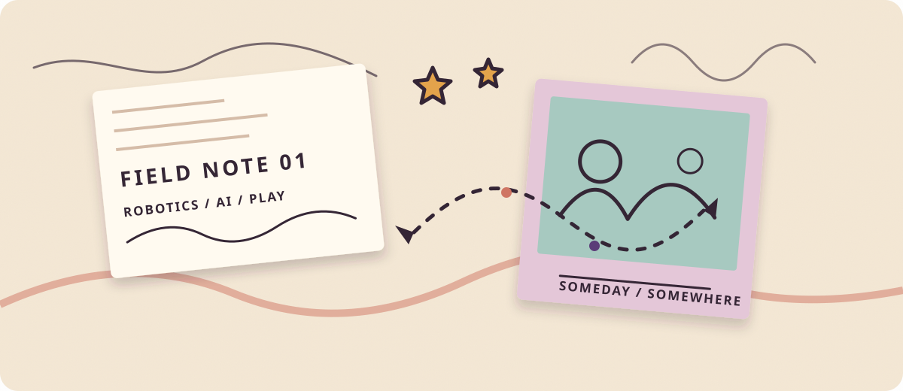

<div align="center">



# BADGER · 杨子豪

### I build machines that notice things.

[](https://badgerlog.icu) [](https://github.com/Yangbadger222)

</div>

> *Somewhere between a sketchbook and a control room.*
>
> I’m a student at **XJTLU** exploring the edges of robotics, AI and expressive software. I like useful systems, strange prototypes and the moment a rough idea starts moving.

<div align="center">

`ROBOTICS` &nbsp; · &nbsp; `COMPUTER VISION` &nbsp; · &nbsp; `VLA / AGENTS` &nbsp; · &nbsp; `FULL-STACK`

</div>

---

## A small map of what I’m making

| **01 / LISTEN** | **02 / SEE** | **03 / MOVE** |
|:---|:---|:---|
| Emotion Bot — a conversational system with a memory. | SEVP — sparse road-vertex proposals from visual evidence. | Robo Agent — tools and planning for physical worlds. |
| [open the notebook ↗](https://github.com/Yangbadger222/emotion_bot) | [inspect the map ↗](https://github.com/Yangbadger222/SEVP) | [follow the route ↗](https://github.com/Yangbadger222/robo-agent) |

<br>

<div align="center">

### Selected experiments

[](https://github.com/Yangbadger222/XJTLU-Food-Recommendation-System) [](https://github.com/Yangbadger222/IK-learning-note)

</div>

## The tools on my desk

```text
PYTHON       ████████████████████  models · vision · experiments
TYPESCRIPT   ███████████████░░░░░  agents · interfaces · web
C++ / ROS2   ████████████░░░░░░░░  robots · motion · hardware
```

<div align="center">

    

</div>

## Recent signal

<div align="center">

 

</div>

<div align="center">

[](https://git.io/streak-stats)

</div>

---

<div align="center">

**If you find a loose thread, pull it.**

[badgerlog.icu](https://badgerlog.icu) &nbsp; / &nbsp; [github.com/Yangbadger222](https://github.com/Yangbadger222)

<sub>✦ currently collecting better questions ✦</sub>

</div>
